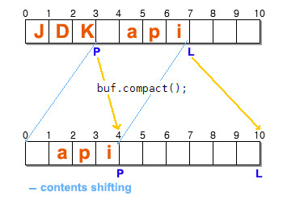

# What about java.nio.Buffer?

## "Fill" and "Drain"

Java NIO Buffer manipulation is done in two contexts, "Fill state" and "Drain state".
"Fill state" means that data is put into the buffer and "Drain state" that data in the buffer is retrieved outside.
(But data is not removed from the buffer during "Drain state")

## Operations 

- flip() - 
- rewind() - 
- mark() - 
- reset() - 
- compact() - 

## Examples

When a new NIO buffer is created, it starts in "Fill state", which may be reasonable because if it starts in "Drain state", no data is available:

After putting some values, "position" of the buffer is advanced by seven, the length of "JDK api" and "limit" remains unchanged.
Now that some values are added, we can retrieve them from the buffer, and so the state is converted into "Drain state" by calling "flip()":

"flipping" sets "limit" value to "position" and then "position" value to zero. "limit" changes only when the buffer state changes between "fill" and "drain", and you should never exceed "limit" regardless of the state, otherwise an exception (BufferOverflowException or BufferUnderFlowException) is thrown:

Five charactes are retrieved from buffer and then filled into a character array of which length is five. ( Two more still remains, "pi") "position" of the buffer is set to 5 and next operation will be done from here to "limit".
If data needs to be copied repeatedly, we have to call "rewind():

It set "position" value  of the buffer to zero(but does not touch "limit" value.) After calling rewind(), we can copy the same data from the buffer.
Below picture shows another version of "get()" having two int parameters, one is the index of "dest" array and the other is length of data to be copied. So it has effect on "dest' array, not buffer itself except the "position" value of the buffer is changed.

To fill the buffer with data to follow, switch the state using "compact()".

"compact()" makes two changes to the buffer.

1) copies the valid data(" api") to the beginning of the buffer, resulting data between 0 and 4(length of " api") overwrited.
2) "position" is set next the valid data(" api") and "limit" to the capacity, 10.

Making the valid data " api" located at the head of the buffer, subsequent "filling" start from "position", resulting in the " api" undamaged for following "Drain state".
"mark()" leaves trace of "position" value for later use.

There is no way to get "mark" value when looking at the Buffer api because it is just a sign and doesn't have to do.
While manipulating the buffer, if you have to move "position" value back or cancel the manipulation, calling "reset()" do it for you.

Be sure that "reset()" always sets "position" back to the "mark", so if there is no mark(if you never called "mark()" before), it will throw "java.nio.InvalidMarkException". Once you call "mark()", it remains valid and "reset()" works without exceptions, until mark is smaller than "position".

"mark" value set by "mark()" is invalidated only when "mark" is greater than "position" or "limit".
"mark" validation is check whenever "position" or "limit" changes. If "mark" set by former "mark()" is smaller than "position" and "limit", then it continue to be valid regardless of the state.
In fact, the methods mentioned above can be called regardless of "Fill" and "Drain" state. If it is needed, "get(..)" may be called in "Fill state". But, in most of cases, "putting data into buffer" leads to "retrieving data from buffer" and vise versa, which groups the methods naturally by the context they are used.

## Links

- [Source](https://javafreak.tistory.com/211) - Original article
- [Documentation](https://docs.oracle.com/javase/6/docs/api/java/nio/Buffer.html) - Oracle documentation 
